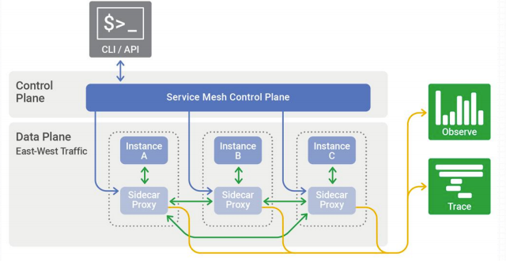
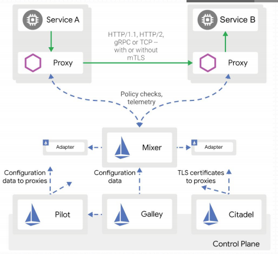
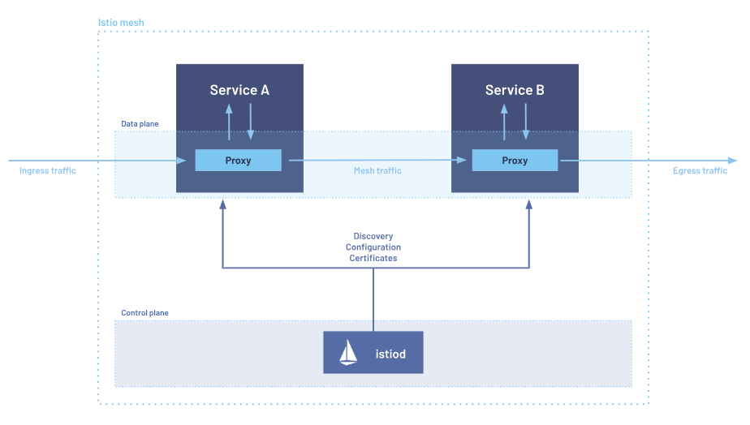

# Istio 架构概述

Istio是一个开源的独立服务网格，是Envoy Data Plane的控制平面实现，可为用户成功运行分布式微服务架构提供所需的基础设施。Istio 服务网格逻辑上分为数据平面和控制平面。

- 数据平面：服务网格应用程序中管理实例之间的网络流量的部分，以Sidecar的形式与服务进程运行在一起
- 控制平面：生成和部署控制数据平面行为的相关配置，主要由Pilot、Mixer、Citadel 和Galley四个组件组成
  - API接口
  - 命令行界面
  - 用于管理应用程序的图形用户界面



## Istio 系统架构



|  | 组件    | 程序文件                              | 功能                                                                    |
|--|-------|-----------------------------------|-----------------------------------------------------------------------|
| 控制平面 | Pilot | istio-pilot                       | 管理和配置部署在Istio服务网格中的所有Envoy代理实例                                        |
|  | Mixer | istio-telemetry <br> istio-policy | 负责收集遥测数据<br>负责执行访问策略和管理配额                                             |
|  | Citadel |                                   | 负责服务的私钥和数字证书管理，用于提供自动生成、分发、轮换及撤销私钥和数据证书的功能                            |                           |
|  | Citadel |                                   | 负责服务的私钥和数字证书管理，用于提供自动生成、分发、轮换及撤销私钥和数据证书的功能                            | 
| | Galley |                                   | 负责向Istio控制平面的其它组件提供支撑功能，它核验进入网格的配置信息的格式和内容的正确性，并将这些配置信息提供给Pilot和Mixer |

> 这是老版本微架构，新版本 使用 istiod 单体程序实现上述功能




- **Ingress Gateways**: 反向代理，用于将Istio功能（例如，监控和路由规则）应用于进入服务网格的流量
- **Engress Gateways**：正向代理，代理应用流量访问网格内其他应用
- **Istiod**：提供服务发现、配置和证书管理

Istio的所有路由规则和控制策略都基于Kubernetes CRD实现，于是，其各种配置策略的定义也都保存于kube-apiserver后端的存储etcd中；
- kube-apiserver也就是Istio的APIServer
- Galley负责从kube-apiserver加载配置并进行分发

Istio提供了大量的CRD，它们大体可分为如下几类:

| 类型             | 实现组件 | 资源                                                                         | 功能 |
|----------------| --- |----------------------------------------------------------------------------| --- |
| Network      | Pilot | VirtualService<br>DestinationRule<br>Gateway<br>ServiceEntry<br>EnvoyFilte | 实现流量治理|
| Authentication | Citadel | Policy<br>MeshPolicy | 实现策略认证|
| Config | Mixer | httpapispecbindings.config.istio.io<br>httpapispecs.config.istio.io | 实现Mixer的各种配置需求 |


## 快速部署Istio

> 前提：准备好kubernetes集群

- kubertes: v1.23.5
- istio: v1.12.1

- 下载istioctl及相关的安装文件和示例文件

```shell
~# wget https://github.com/istio/istio/releases/download/1.12.1/istio-1.12.1-linux-amd64.tar.gz
~# tar -xf istio-1.12.1-linux-amd64.tar.gz  -C /usr/local/
~# ln -sv /usr/local/istio-1.12.1/ /usr/local/istio

~#  cp /usr/local/istio/bin/istioctl /usr/bin/
~# istioctl version
no running Istio pods in "istio-system"
1.12.1
```

| 内置配置档案 | 说明                                          | 推荐使用 | istio-egressgateway | istio-ingressgateway | istiod |
| --- |---------------------------------------------|------| --- | -- | - |
| default | 根据IstioOperator API的默认设置启用相关的组件，适用于生产环境     | ✅    | | ✅ | ✅|
| demo | 会部署较多的组件，旨在演示istio的功能，适用于运行BookInfo一类的应用程序  | ✅    | ✅ | ✅ | ✅ |
| minimal | 类似于default profile，但仅部署控制平台组件               |      | | |✅|
| remote | 用于配置共享Control Plance的多集群环境                  |      |
| empty | 不部署任何组件，同在帮助用户在自定义profile是生成基础的配置信息         |      |
| preview | 包含预览性配置的profile，用于探索istio新功能，但不保证稳定性、安全性和性能 | ❗️   | | ✅|✅|

- 查看内建 profile
```shell
~# istioctl profile list
Istio configuration profiles:
    default
    demo
    empty
    external
    minimal
    openshift
    preview
    remote
```
- 查看某profile详细信息
```shell
~# istioctl profile dump demo
```

- 安装istio控制平面
```shell
~# istioctl install --set profile=demo -y
✔ Istio core installed                                                                                                                                                                       
✔ Istiod installed                                                                                                                                                                           
✔ Egress gateways installed                                                                                                                                                                  
✔ Ingress gateways installed                                                                                                                                                                 
✔ Installation complete                                                                                                                                                                      Making this installation the default for injection and validation.

Thank you for installing Istio 1.12.  Please take a few minutes to tell us about your install/upgrade experience!  https://forms.gle/FegQbc9UvePd4Z9z7

~# kubectl  get pod -n istio-system -o wide
NAME                                    READY   STATUS    RESTARTS   AGE     IP            NODE           NOMINATED NODE   READINESS GATES
istio-egressgateway-65bdddf685-6fk64    1/1     Running   0          117s    10.244.3.15   k8s-worker03   <none>           <none>
istio-ingressgateway-7b545cdbc7-cmpx4   1/1     Running   0          117s    10.244.1.14   k8s-worker01   <none>           <none>
istiod-864977fd6c-lf7hr                 1/1     Running   0          2m59s   10.244.3.14   k8s-worker03   <none>           <none>```
```

- 部署addons
```shell
~# cd /usr/local/istio/             
/usr/local/istio# kubectl  apply -f samples/addons/
/usr/local/istio# kubectl  get pod -n istio-system -w
NAME                                    READY   STATUS    RESTARTS   AGE
grafana-5fb899f96-7q7cq                 1/1     Running   0          4m5s
istio-egressgateway-65bdddf685-6fk64    1/1     Running   0          12m
istio-ingressgateway-7b545cdbc7-cmpx4   1/1     Running   0          12m
istiod-864977fd6c-lf7hr                 1/1     Running   0          13m
jaeger-d7849fb76-5xql5                  1/1     Running   0          4m5s
kiali-c9d6f75d5-p6tm5                   1/1     Running   0          4m5s
prometheus-d7df8c957-r95fw              2/2     Running   0          4m4s
```

- 标记名称空间自动注入sidercar
```shell
~# kubectl label namespace default istio-injection=enabled
~# kubectl  create deployment demoapp --image=ikubernetes/demoapp:v1.0 --replicas=3
deployment.apps/demoapp created
~# kubectl  get pod  -owide
NAME                       READY   STATUS    RESTARTS   AGE     IP            NODE           NOMINATED NODE   READINESS GATES
demoapp-5748b7ccfc-g96k7   2/2     Running   0          2m49s   10.244.1.18   k8s-worker01   <none>           <none>
demoapp-5748b7ccfc-kzjg6   2/2     Running   0          2m49s   10.244.2.17   k8s-worker02   <none>           <none>
demoapp-5748b7ccfc-s947x   2/2     Running   0          2m49s   10.244.3.20   k8s-worker03   <none>           <none>

~# kubectl  exec -it demoapp-5748b7ccfc-s947x -- curl localhost:15000/listeners
750a3fbc-694b-4573-a86b-5a7d2e5b5075::0.0.0.0:15090
914ef458-da0d-49c4-8b30-11e7de70fd11::0.0.0.0:15021
10.101.188.140_443::10.101.188.140:443
10.106.26.93_443::10.106.26.93:443
10.106.26.93_31400::10.106.26.93:31400
10.96.0.1_443::10.96.0.1:443
10.96.0.10_53::10.96.0.10:53
10.101.188.140_15012::10.101.188.140:15012
10.100.191.210_443::10.100.191.210:443
10.106.26.93_15443::10.106.26.93:15443
0.0.0.0_15014::0.0.0.0:15014
10.100.9.63_14250::10.100.9.63:14250
10.99.69.60_3000::10.99.69.60:3000
10.100.9.63_14268::10.100.9.63:14268
0.0.0.0_20001::0.0.0.0:20001
10.98.71.107_80::10.98.71.107:80
0.0.0.0_15010::0.0.0.0:15010
10.106.26.93_15021::10.106.26.93:15021
0.0.0.0_80::0.0.0.0:80
0.0.0.0_9411::0.0.0.0:9411
0.0.0.0_9090::0.0.0.0:9090
10.96.0.10_9153::10.96.0.10:9153
0.0.0.0_16685::0.0.0.0:16685
virtualOutbound::0.0.0.0:15001
virtualInbound::0.0.0.0:15006

~# kubectl  exec -it demoapp-5748b7ccfc-s947x -- curl localhost:15000/clusters
```

- 卸载Istio
```shell
kubectl delete -f samples/addons
istioctl x uninstall -y --purge
kubectl label namespace default istio-injection-
kubectl delete namespace istio-system
```

## Istioctl 命令

- 查看配置下发的状态
```shell
istioctl proxy-status [<type>/]<name>[.<namespace>] [flags]
```
```shell
~# istioctl proxy-status
NAME                                                   CDS        LDS        EDS        RDS          ISTIOD                      VERSION
demoapp-5748b7ccfc-g96k7.default                       SYNCED     SYNCED     SYNCED     SYNCED       istiod-864977fd6c-lf7hr     1.12.1
demoapp-5748b7ccfc-kzjg6.default                       SYNCED     SYNCED     SYNCED     SYNCED       istiod-864977fd6c-lf7hr     1.12.1
demoapp-5748b7ccfc-s947x.default                       SYNCED     SYNCED     SYNCED     SYNCED       istiod-864977fd6c-lf7hr     1.12.1
istio-egressgateway-65bdddf685-6fk64.istio-system      SYNCED     SYNCED     SYNCED     NOT SENT     istiod-864977fd6c-lf7hr     1.12.1
istio-ingressgateway-7b545cdbc7-cmpx4.istio-system     SYNCED     SYNCED     SYNCED     NOT SENT     istiod-864977fd6c-lf7hr     1.12.1
root@k8s-master01:~# 
```

- 查看配置信息
```shell
istioctl proxy-config <clusters|listeners|routes|endpoints|bootstrap|log|secret> <pod-name[.namespace]>
```
```shell
~# istioctl proxy-config clusters demoapp-5748b7ccfc-g96k7.default --port 80
SERVICE FQDN                                            PORT     SUBSET     DIRECTION     TYPE     DESTINATION RULE
istio-egressgateway.istio-system.svc.cluster.local      80       -          outbound      EDS      
istio-ingressgateway.istio-system.svc.cluster.local     80       -          outbound      EDS      
myapp.default.svc.cluster.local                         80       -          outbound      EDS      
tracing.istio-system.svc.cluster.local                  80       -          outbound      EDS  
```

## 流量治理


