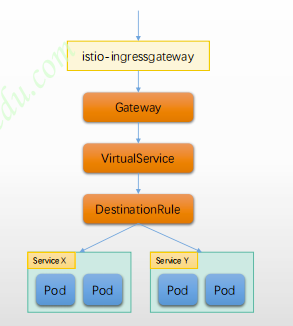

# 流量治理

## 核心概念

Istio的流量路由规则使运维人员可以轻松控制服务之间的流量和API调用

- Istio简化了诸如断路器，超时和重试之类的服务级别属性的配置，并使其易于设置重要任务（如A/B测试，canary部署和基于百分比的流量拆分的分段部署）
- 它还提供了开箱即用的故障恢复功能，有助于使应用程序更强大，以防止相关服务或网络的故障

使用Istio进行流量管理从本质上是将流量与底层基础架构的伸缩机制相解耦，从而让运维工程师能够 通过Pilot指定他们希望流量自身需要遵循哪些规则，而非仅仅只能定义由哪些特定的pod/VM接收流量并在这些pod/VM之间以受限于数量比例的方式分配流量

Istio的所有路由规则和控制策略都基于Kubernetes CRD实现，这包括网络功能相关的VirtualService、DestinationRule、Gateway、ServiceEntry和EnvoyFilter等；

| CRD     |                  | 用途                                        |
|---------|------------------|-------------------------------------------|
| Gateway | Ingress Gateway  | 定义一个负载均衡器, 用于承载网络边缘流量的进入和发出     |
| | Egress Gateway   |                                           |
| ServiceEntry | | 注册路由表， 让网格中能自动发现和访问手动添加的服务                |
|VirtualService |  | 定于指定服务器的流量路由规则 ，将处理后的流量路由到指定的目的地Destination |
| DestinationRule | | 决定经过路由处理后的流量的访问策略                         |
 | EnvoyFilter | | 使用filter 为特定的envoy 添加配置                   |

## 流量治理基础

集群外部的入站流量会经由 Ingress Gateway 到达集群内部：

- 由Gateway定义ingress Gateway上的虚拟主机，虚拟主机信息如下，
    - hosts：流量要访问的主机名
    - port：监听端口
  
- 集群内部的流量会在 Sidercar之间流动
    - VirtualService 为Sidercar Envory 定义 listener，主要定义流量的路由机制
      - DestinationRule 为 Sidercar Envory 定义Cluster， 包括端点发现机制

## 网格流量治理

在Kubernetes系统上，Istio会将网格重的每个Service的端口一个Listener， Service匹配到的endpoint将组合成为一个Cluster。

###  

