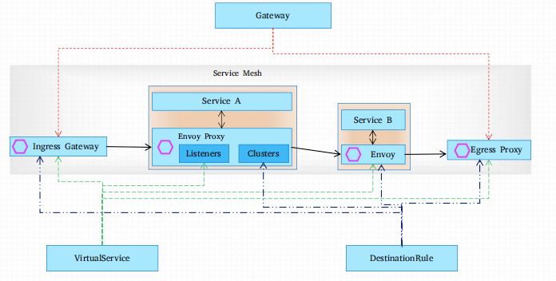

## 流量治理

### 核心概念

Istio的流量路由规则使运维人员可以轻松控制服务之间的流量和API调用，所有路由规则和控制策略都基于Kubernetes CRD实现，这包括网络
功能相关的VirtualService、DestinationRule、Gateway、ServiceEntry和 EnvoyFilter等；

| CRD     |                  | 用途                                        |
|---------|------------------|-------------------------------------------|
| Gateway | Ingress Gateway  | 定义一个负载均衡器, 用于承载网络边缘流量的进入和发出     |
| | Egress Gateway   |                                           |
| ServiceEntry | | 注册路由表， 让网格中能自动发现和访问手动添加的服务                |
|VirtualService |  | 定于指定服务器的流量路由规则 ，将处理后的流量路由到指定的目的地Destination |
| DestinationRule | | 决定经过路由处理后的流量的访问策略                         |
 | EnvoyFilter | | 使用filter 为特定的envoy 添加配置                   |

集群外部的入站流量会经由 Ingress Gateway 到达集群内部：

- 由Gateway定义ingress Gateway上的虚拟主机，虚拟主机信息如下，
    - hosts：流量要访问的主机名
    - port：监听端口
  
- 集群内部的流量会在 Sidercar之间流动
    - VirtualService 为Sidercar Envory 定义 listener，主要定义流量的路由机制
      - DestinationRule 为 Sidercar Envory 定义Cluster， 包括端点发现机制

